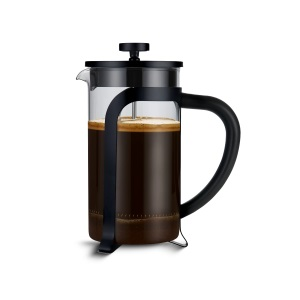

# The Dinner Party Game
### A guessing game for 4-10 players
## How it works
- Once you join the game, you are asked a question.
- When all players have given an answer, the game begins.
- All the answers are displayed, anonymously.
- Taking it in turns, the players have to guess which player gave each answer.
- Once a player and their answer have been correctly guessed, that player is "out".
- When only one player remains, they are the winner.

# Development ideas & psuedocode

### welcome route (dinner:welcome)
- If game_started = False, then give each player landing on welcome.html the option to start a new game.
- If game_started = "lobby", then give each player landing on welcome.html the option to join the lobby (via the `join` route).
- if game_started = True, then post a message "A round has already started, you will join the next round" and deal with the logic to allow the player to spectate
- Check the state of game_started when the `start game` button is pressed; if it is False then deal with the logic for starting a new game including choosing a question, make that player the host and sending them to the `join` route. Otherwise, deal with the request as if they had clicked `join game`.  

### join route (dinner:join)
- ask the player's name, if we don't already know it
- say welcome <player>
- register the player as having joined.
- ask them a question
- direct them to the lobby

### lobby route (dinner:lobby)
- In the lobby all players can: see who else is in the lobby; send invitations by whatsapp; see who has been invited but not yet responded; see who has declined; see who has yet to answer the question, post messages to a chat box.
- When the host can see that enough players have joined, they can press `start game`. This selects a guesser at random and directs to the guessing route, and updates the game_started variable to True
- There is an event handler which checks for the game_started variable changing to True, and redirects to the guessing route.

### gameplay route (dinner:guessing)
- if the player is the guesser, and has not yet guessed an answer, they will see a list of all the answers (including theirs). They can select any answer except their own.
- if the player is the guesser, and has guessed an answer, they will see the answer they have selected, and a list of all the remaining players (including theirs). They can select any remaining player.
- when both an answer and a player have been selected, the players are taken to a guessmade route to handle to logic.
- if the player is not the guesser, they will see a message <player> is guessing..., then <player> has chosen <answer>...
- the existing lobby chatbox will persist

### guessmade route (dinner:guessmade)
- a message will be displayed <guesser> guessed that <guessedPlayer> answered <guessedAnswer> and this is...
- a timer (1 second)
- display "CORRECT"! or "WRONG!"
- a timer (1 second)
If WRONG:
- display "it is now <guessedPlayer>'s turn"
- display a message for <guessedPlayer> only `OK`
- when guessedPlayer clicks `OK`, go to the guessing route.
IF CORRECT:
- display a message <guessedPlayer> is out" and handle the logic for removing them from the player list
- a timer (1 second)
- If there are 2 or more players remaining:
  - display a message "The remaining players are..." list players
  - a timer (1 second)
  - display "<guesser> plays again"
  - display a message for guesser only: `OK`
  - go to guessing route
- If there is only <guesser> remaining: go to "winner" route

### winner route (dinner:winner)
- display a message
- <guesser wins!>
- timer 1 second
- ask <guesser> to choose a question for the next game (give a choice of 3 questions or to ask their own question.
- button `play again` will take the player to the "next question" route

### next question route (dinner:nextquestion)
- if the question has not yet been defined, display "<guesser> is choosing the next question..."
- as soon as the question is defined, ask the user the question. Store the answer and head to the lobby route.

